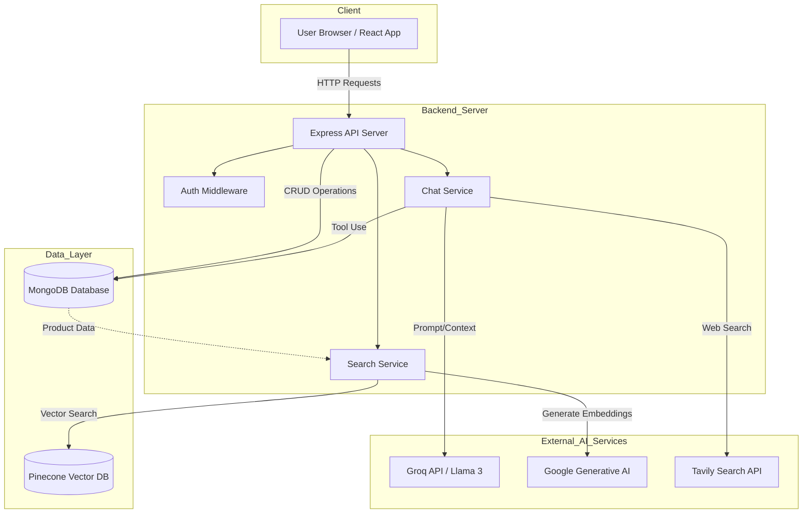
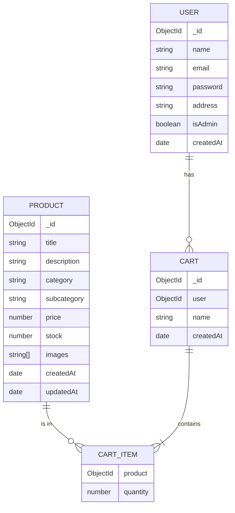

# Talk2Shop Product Documentation

## 1. Product Description

**Talk2Shop** is an innovative, AI-powered e-commerce platform designed to revolutionize the online shopping experience. By bridging the gap between traditional e-commerce interfaces and natural language interaction, Talk2Shop allows users to discover products through intuitive conversation and semantic search.

At its core, Talk2Shop integrates advanced Large Language Models (LLMs) and vector database technology to understand user intent, providing personalized product recommendations and a seamless shopping journey. Beyond the customer-facing interface, it features a robust administrative dashboard for comprehensive inventory and user management, making it a complete solution for modern digital retail.

## 2. Product Features

### 2.1 AI-Powered Shopping Assistant
*   **Conversational Interface:** Users can interact with a smart chatbot to ask for product recommendations, check availability, and get details using natural language.
*   **Contextual Understanding:** The AI agent leverages LangChain and Groq to understand complex queries and maintain context during the conversation.
*   **External Information Retrieval:** Integrated with Tavily Search to provide up-to-date information when necessary.

### 2.2 Advanced Semantic Search
*   **Vector-Based Search:** Utilizes Pinecone and Google Generative AI embeddings to perform semantic searches. Users can find products by describing them (e.g., "summer wear for beach") rather than just matching keywords.
*   **Smart Filtering:** Automatically filters results based on categories and subcategories derived from the user's intent.

### 2.3 User Management & Security
*   **Secure Authentication:** Robust sign-up and login processes using JWT (JSON Web Tokens) and bcrypt for password hashing.
*   **Profile Management:** Users can manage their personal details and addresses.
*   **Role-Based Access Control:** distinct roles for standard users and administrators.

### 2.4 Comprehensive Admin Dashboard
*   **Product Management:** Admins can add, update, and delete products, including managing images, prices, and stock levels.
*   **Inventory Tracking:** Real-time visibility into stock levels to prevent overselling.
*   **User Oversight:** Capability to view and manage user accounts.
*   **Order Management:** Tools to track and process customer orders (implied capability based on structure).

### 2.5 Shopping Cart Functionality
*   **Persistent Cart:** Users can add items to their cart, update quantities, and view summaries.
*   **Seamless Integration:** The cart is tightly integrated with the product catalog and user sessions.

## 3. Product Benefits

*   **Enhanced User Experience:** The conversational AI removes the friction of traditional filters and search bars, making shopping more engaging and human-like.
*   **Higher Conversion Rates:** By accurately understanding user needs and providing relevant recommendations, customers are more likely to find what they want quickly.
*   **Operational Efficiency:** The admin dashboard centralizes management tasks, allowing business owners to handle inventory and users effectively.
*   **Scalability:** Built on a modern MERN stack with cloud-native AI services, the platform is designed to scale with growing inventory and user traffic.
*   **Data-Driven Insights:** The use of vector databases allows for sophisticated data retrieval that can uncover patterns in user search behavior.

## 4. Product Use Cases

### 4.1 The Indecisive Shopper
**Scenario:** A user wants to buy a gift but doesn't know exactly what to get.
**Flow:** The user types, "I need a birthday gift for my tech-savvy brother under $50." The AI analyzes the request, queries the product database for electronics in that price range, and presents a curated list of suggestions with descriptions explaining why they are good matches.

### 4.2 The Specific Searcher
**Scenario:** A user is looking for a specific type of clothing.
**Flow:** The user searches for "comfortable running shoes for flat feet." The semantic search engine understands the attributes "comfortable" and "running," retrieves products with those semantic qualities from the vector database, and displays the most relevant results.

### 4.3 The Store Administrator
**Scenario:** The business owner receives a new shipment of stock.
**Flow:** The admin logs into the dashboard, navigates to the Product Management section, and uses the interface to upload new product images, set prices, and define stock levels. The system automatically indexes these new products for the AI search.

## 5. Product Implementation

### 5.1 Technology Stack

*   **Frontend:** React.js (Vite) for a fast, responsive user interface. Tailwind CSS for modern styling.
*   **Backend:** Node.js with Express.js for a scalable RESTful API.
*   **Database:**
    *   **MongoDB:** Primary database for storing user profiles, product details, orders, and cart data.
    *   **Pinecone:** Vector database for storing product embeddings to enable semantic search.
*   **AI & ML Services:**
    *   **LangChain:** Framework for orchestrating the AI agents and tools.
    *   **Groq (Llama 3):** High-performance LLM for processing chat interactions.
    *   **Google Generative AI:** Used for generating text embeddings for semantic search.
    *   **Tavily:** Search tool for external knowledge retrieval.

### 5.2 System Architecture

The system follows a client-server architecture where the React frontend communicates with the Node.js backend via REST APIs. The backend acts as an orchestrator, interacting with the MongoDB database for transactional data and external AI services for intelligence features.

### 5.3 Entity Relationship Diagram (ERD)

The database schema is designed to support users, products, and their interactions via the shopping cart.

