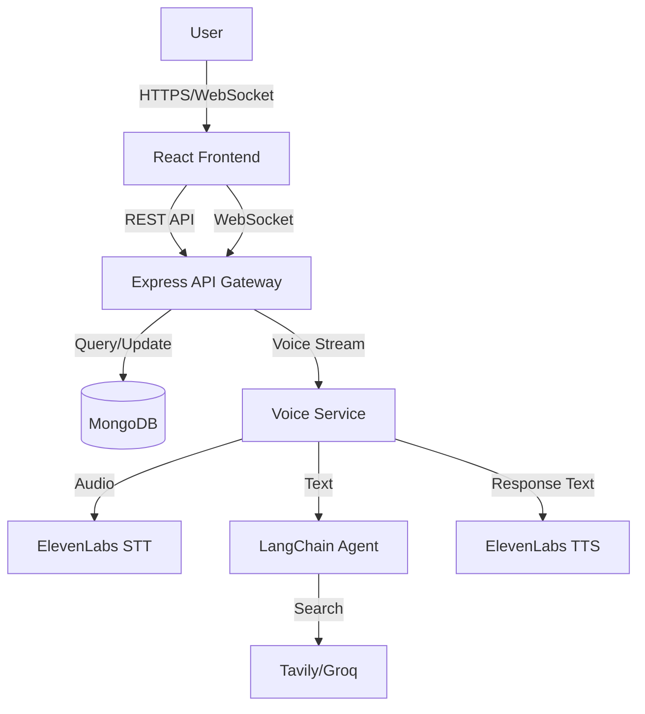
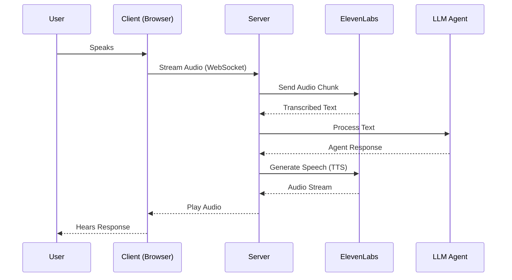
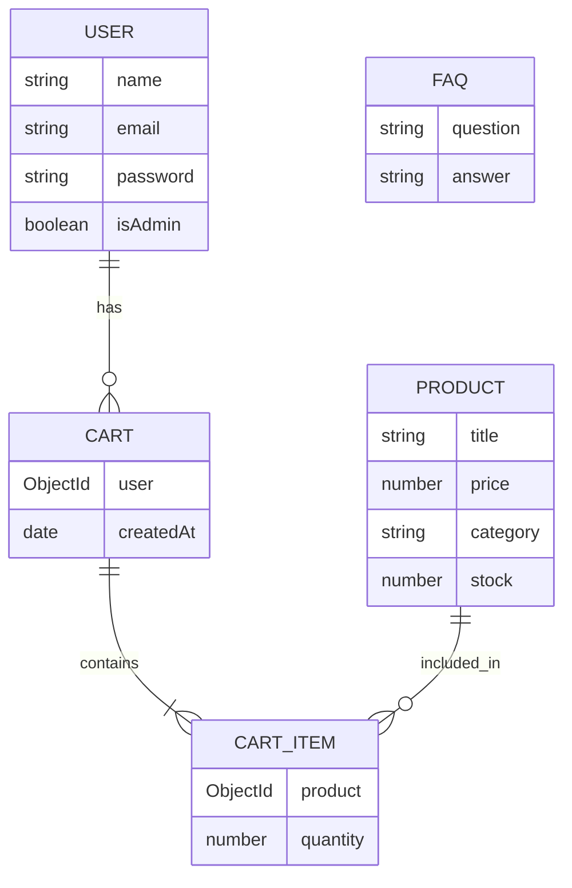

# Project Report: Talk2Shop - AI-Powered E-Commerce Platform

**Contents Page No**

1. [Chapter 1 Introduction](#chapter-1-introduction)
   1.1. [Purpose of This Study](#11-purpose-of-this-study)
   1.2. [Brief Overview of the Project Report](#12-brief-overview-of-the-project-report)
2. [Chapter 2 Literature Overview](#chapter-2-literature-overview)
3. [Chapter 3 Problem Definition & Objectives](#chapter-3-problem-definition--objectives)
4. [Chapter 4 Feasibility Study](#chapter-4-feasibility-study)
5. [Chapter 5 System Analysis/Proposed Scheme](#chapter-5-system-analysisproposed-scheme)
6. [Chapter 6 Software Engineering Paradigm Applied](#chapter-6-software-engineering-paradigm-applied)
7. [Chapter 7 Software and Hardware Requirement Specifications](#chapter-7-software-and-hardware-requirement-specifications)
8. [Chapter 8 System Design](#chapter-8-system-design)
9. [Chapter 9 Database Design](#chapter-9-database-design)
10. [Appendices](#appendices)
    A. [List of technical terms](#a-list-of-technical-terms)
    B. [Abbreviations used](#b-abbreviations-used)
11. [Bibliography](#bibliography)

---

## Chapter 1 Introduction

### 1.1. Purpose of This Study
The purpose of this project is to develop "Talk2Shop," an innovative e-commerce platform that integrates advanced Artificial Intelligence (AI) to enhance the user shopping experience. Unlike traditional e-commerce sites that rely solely on visual navigation and text search, Talk2Shop incorporates a conversational AI agent capable of both voice and text interactions. This study aims to demonstrate the practical application of Large Language Models (LLMs), Text-to-Speech (TTS), and Speech-to-Text (STT) technologies in a real-world retail context, bridging the gap between physical in-store assistance and digital shopping.

### 1.2. Brief Overview of the Project Report
This report documents the complete development lifecycle of the Talk2Shop application. It covers the initial problem definition, feasibility analysis, system architecture, and detailed design of both the software and database components. The report highlights the integration of modern web technologies (React, Node.js) with cutting-edge AI services (ElevenLabs, LangChain) to create a seamless, interactive user interface.

## Chapter 2 Literature Overview
The evolution of e-commerce has moved from simple catalog listings to personalized recommendation engines. However, the primary mode of interaction has remained largely unchanged: point-and-click interfaces. Recent advancements in Natural Language Processing (NLP) and Generative AI have opened new avenues for "Conversational Commerce." Literature in this domain suggests that voice-enabled interfaces can significantly reduce friction for users, particularly on mobile devices or for users with accessibility needs. This project builds upon existing research into WebSocket-based real-time communication and agentic AI workflows to create a responsive virtual shopping assistant.

## Chapter 3 Problem Definition & Objectives

**Problem Definition:**
Traditional e-commerce platforms often suffer from "choice paralysis" and a lack of personalized guidance. Users must navigate complex filter systems to find products. If they have specific questions (e.g., "Is this good for a formal event?"), they often have to leave the platform to research, leading to potential sales loss.

**Objectives:**
1.  **Develop a Full-Stack E-Commerce Application**: Create a robust platform supporting user authentication, product browsing, and cart management.
2.  **Integrate AI Voice Agent**: Implement a real-time voice agent using ElevenLabs for high-quality speech synthesis and recognition.
3.  **Enable Natural Language Search**: Allow users to find products using conversational queries (e.g., "Show me red sneakers under $50").
4.  **Ensure Real-Time Interaction**: Utilize WebSockets to provide low-latency communication between the user and the AI agent.

## Chapter 4 Feasibility Study

**Technical Feasibility:**
The project utilizes the MERN stack (MongoDB, Express, React, Node.js), a mature and widely supported technology set. The AI components rely on established APIs (ElevenLabs, Groq/Tavily via LangChain), ensuring reliability. The modular architecture allows for easy scaling and maintenance.

**Operational Feasibility:**
The system is designed to be user-friendly, requiring no special training for end-users. The automated nature of the AI agent reduces the need for human customer support for routine queries, making it operationally efficient.

**Economic Feasibility:**
By leveraging cloud-based AI services on a pay-per-use basis (or free tiers for development), the initial infrastructure cost is kept low while offering enterprise-level capabilities.

## Chapter 5 System Analysis/Proposed Scheme

The proposed scheme is a centralized web application architecture with the following flow:
1.  **User Interface**: A responsive React application serves as the entry point.
2.  **API Gateway**: An Express.js server handles HTTP requests for standard operations (auth, products) and WebSocket connections for voice.
3.  **AI Orchestration**:
    - **Voice Processing**: Audio is streamed to the backend, transcribed (STT), processed by an LLM, and converted back to speech (TTS) using ElevenLabs.
    - **Context Awareness**: The AI agent has access to the product database and can query it to provide accurate recommendations.
4.  **Data Persistence**: MongoDB stores user profiles, product catalogs, and order information.

### System Architecture Diagram

## Chapter 6 Software Engineering Paradigm Applied

This project follows an **Agile/Iterative** software engineering paradigm.
- **Iteration 1**: Core e-commerce features (Auth, Products, Cart).
- **Iteration 2**: Basic Chat Agent integration.
- **Iteration 3**: Advanced Voice Agent with WebSocket integration.
- **Iteration 4**: Refinement, testing, and UI polishing.

This approach allowed for continuous feedback and rapid adaptation to new requirements (e.g., switching to an ElevenLabs-only voice pipeline).

## Chapter 7 Software and Hardware Requirement Specifications

**Software Requirements:**
-   **Operating System**: Cross-platform (Windows/Linux/macOS) for development; Linux for deployment.
-   **Runtime Environment**: Node.js (v18+).
-   **Database**: MongoDB (v6+).
-   **Frontend Framework**: React (v18+) with Vite.
-   **External APIs**: ElevenLabs (Voice), Groq/Tavily (LLM/Search).

**Hardware Requirements (Server):**
-   Standard cloud compute instance (e.g., AWS EC2, DigitalOcean Droplet).
-   Minimum 2GB RAM (for Node.js and in-memory operations).

**Hardware Requirements (Client):**
-   Device with a modern web browser (Chrome, Firefox, Edge).
-   Microphone and Speakers (for voice features).
-   Internet connection.

## Chapter 8 System Design

The system is divided into two main subsystems:

**1. Frontend (Client-Side):**
-   **Tech**: React, TailwindCSS.
-   **Components**:
    -   `VoiceAgent`: Handles microphone input and audio playback.
    -   `ProductList`: Displays catalog with filtering.
    -   `Cart`: Manages selected items.
    -   `ChatInterface`: Text-based alternative to voice.

**2. Backend (Server-Side):**
-   **Tech**: Node.js, Express.
-   **Modules**:
    -   `server.js`: Main entry point.
    -   `routes/`: API endpoints (`/auth`, `/products`, `/voice`).
    -   `services/voiceAgentService.js`: Handles interaction with ElevenLabs.
    -   `config/voiceWebSocket.js`: Manages real-time audio streams.

### Voice Processing Flow

## Chapter 9 Database Design

The database is implemented using MongoDB with Mongoose schemas.

**1. User Schema (`User.js`)**
-   `name`: String (Required)
-   `email`: String (Unique, Required)
-   `password`: String (Hashed)
-   `isAdmin`: Boolean
-   `address`: String

**2. Product Schema (`Product.js`)**
-   `title`: String (Indexed for text search)
-   `description`: String
-   `price`: Number
-   `category`: String
-   `stock`: Number
-   `images`: Array of Strings

**3. Cart Schema (`Cart.js`)**
-   `user`: ObjectId (Ref: User)
-   `items`: Array of Objects
    -   `product`: ObjectId (Ref: Product)
    -   `quantity`: Number

**4. FAQ Schema (`FAQSchema.js`)**
-   `question`: String
-   `answer`: String

### Database ER Diagram

## Appendices

### A. List of technical terms
-   **WebSocket**: A computer communications protocol, providing full-duplex communication channels over a single TCP connection.
-   **Middleware**: Software that provides common services and capabilities to applications outside the operating system.
-   **JWT (JSON Web Token)**: A compact, URL-safe means of representing claims to be transferred between two parties.

### B. Abbreviations used
-   **API**: Application Programming Interface
-   **LLM**: Large Language Model
-   **STT**: Speech-to-Text
-   **TTS**: Text-to-Speech
-   **MERN**: MongoDB, Express, React, Node.js
-   **UI/UX**: User Interface / User Experience

## Bibliography
1.  React Documentation. https://react.dev/
2.  Node.js Documentation. https://nodejs.org/en/docs/
3.  MongoDB Manual. https://www.mongodb.com/docs/manual/
4.  ElevenLabs API Reference. https://elevenlabs.io/docs/api-reference/
5.  Express.js Routing. https://expressjs.com/en/guide/routing.html
